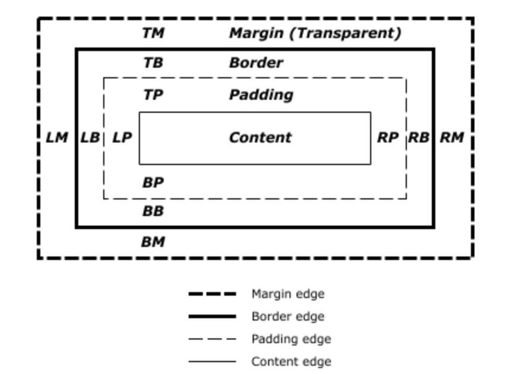

# It’s Hip to Be Square: A Re-introduction to Web Layout 


      

## But Why
* Layout is not cool - there are a million other things that we could talk about. 
* Maybe for this reason that it's misunderstood? Fundamentals often get overlooked in pursuit of the shiny thing.
* Programmers are often quick to dismiss layout - and CSS in general - as secondary or irrelevant to their work. 
* As web developers, we make things **for the web**. If you know terms like “dependency injection” and “memoization” mean, but are overwhelmed at the prospect of styling a login page, then you are missing key skills. 

## Goals
* Familiarize ourselves with the fundamentals of web layout. 
* Understand the different ways that we can apply these technologies when building web pages.

## Let's Review
* The box model
* The `display` property
* Flow, floats, and positioning

These are the primary concepts governing layout in the [visual formatting model](https://www.w3.org/TR/CSS21/visuren.html#visual-model-intro). 

## The Box Model (10 mins)


*Brad Pitt would also like to know what’s in the box*

In order to understand page layout, we first need to understand how individual elements are formed and occupy space.

> The CSS box model describes the rectangular boxes that are generated for elements in the document tree and laid out according to the visual formatting model. 

[Source: W3](https://www.w3.org/TR/CSS2/box.html)



### Content, Padding, Border, and Margin
* **Content area** - contains the “real” element content (text, image, etc). Defined with width and height properties (including `min-width`, `min-height`, etc). 
* **Padding area** - extends the content area. Can be set with the padding property. Pushes against the content. 
* **Border** - the border around the padding and the content. 0 by default. 
* **Margin** - the space surrounding a CSS box. Pushes against other CSS boxes in the layout.

[Chrome Devtools]

### Margin Collapse

>Margins have a specific behavior called margin collapsing. When two boxes touch against one another, the distance between them is the value of the largest of the two touching margins, and not their sum.

[Source: MDN](https://developer.mozilla.org/en-US/docs/Learn/CSS/Introduction_to_CSS/Box_model)

#### :bulb: [DEMO 1](https://codepen.io/soluhmin/pen/ReGqdw)

### Box-sizing
* The `box-sizing` CSS property defines how the user agent should calculate the total width and height of an element. 
* Accepts two values: `content-box` (default) and `border-box`.
* By default, the width and height you assign to an element is **only applied to its content box.** This means that when you set a height and width, you have to adjust the values to account for border and padding (margin is excluded). 
* By setting `box-sizing: border-box;`, the user agent factors in the padding and border values when calculating the total element size. 

#### :bulb: [DEMO 2](https://codepen.io/soluhmin/pen/wYzQgB)

### :warning: Using border to troubleshoot layout :warning:
* We often need to calculate the sizing of things on web pages. Sometimes we want to know how two boxes are laid out next to each other.
* Generally, it's not a good idea to use border for this.
* Border occupies space, which affects layout. Use `outline` instead (ex. `outline: 1px solid red;`).
* Outline doesn’t take up space and is not part of the box model. It also doesn’t have to be rectangular. 

To see all boxes on a page:
```
* {
    outline: 1px solid red;
}
```

## The Display Property (10 mins)
> The display property defines an element’s display type, which consists of the two basic qualities of how an element generates boxes:  
>
> The **inner display type**, which defines (if it is a non-replaced element) the kind of formatting context it generates, dictating how its descendant boxes are laid out. (The inner display of a replaced element is outside the scope of CSS.)  
>
> The **outer display type**, which dictates how the principal box itself participates in flow layout.

[Source: W3](https://www.w3.org/TR/css-display-3/#the-display-properties)

* Examples of `<display-outside>` values include **block** and **inline**. Examples of `<display-inside>` values include **flex**, **grid**, and **table**. 
* All HTML elements are categorized as block or inline elements.  
* We can use the `display` property to override the default display type of an element. We can make block-level elements inline, and inline-level elements block-level. 
* 41 potential display values. 
* We will not be covering most of these.
* Important ones: `block`, `inline`, `inline-block`, `flex`, `grid`, `table`, `none`. 
* `Ruby`?

#### :bulb: [DEMO 3](https://codepen.io/soluhmin/pen/MPbwQW)


### Block
* Occupies the entire width of the parent container. 
* Examples: `<div>`, `<p>`, `<ul>`, `<form>`. 
* Block level elements begin on a new line.
* **Best for:** basic, stacked layouts. 
* **Not as good for**: positioning and multi-column formatting.
### Inline
* Occupies the space bounded by the tags defining the element. 
* Examples: `<textarea>`, `<iframe>`, `<span>`, `<button>`. 
* Inline elements ignore top and bottom margins. 
* They do respect padding, but this padding does not affect the surrounding layout. 
* **Best for**: styling elements inside of block-level elements. 
* **Not as good for**: laying out elements in the normal page flow.
### Inline-block
* The best of block and inline elements: their insides are formatted as a block box, but the outer element is formatted as an inline element. This means that we can apply a width and height to them. We also don’t have to worry about line-breaks like we would with block-level elements. 
* What are some uses?
* **Best for**: positioning elements inside of block-level elements so that margin, padding, and border spacing are all respected; for creating basic and cross-browser compatible multi-column layouts. 
* **Not as good for**: complex multi-column layouts, vertical alignment (especially centering). 
### Flex
* Flexbox is designed as a one-dimensional layout model. 
* Easier to align items than with previous methods. Great for centering.
* Use `justify-content` to align items along the main axis and `align-items` to align content along a secondary axis. 
* Provides additional support for spacing between items. 
* Still requires us to create divs around things. 
* **Best for**: aligning items in more complex ways along a single plane. 
* **Not as good for**: creating grids. Flexbox still requires each group of elements to be nested inside of a div, resulting in nested boxes. The spec implementation is also inconsistent among some versions of IE and Safari. 
### Grid
* The answer to our layout prayers.  
* Allows us to align items in multiple dimensions. 
* Can define a grid template of rows and columns. 
* **Best for**: simple or complex layouts. 
* **Not as good for**: Older browsers. IE doesn’t support the current implementation of Grid (although it does support a very early version). 

## Flow and Positioning (10 mins)

* By default, elements are laid out according to normal flow, with boxes on top of each other in the order that they appear in the source code.
* Certain display properties, such as `flex` and `grid`, can modify the order in which their descendant elements appear. 
* There are a few other ways to change how elements are laid out on the page. We’ll review two of them: floats and position. (There’s also multi-column layout, which we won’t cover.)

### Floats
* Removes the element from the normal flow and shifts it until it reaches the edge of its containing box or another floated element. 
* Originally created for floating images inside text blocks. 
* Evolved to become used for multi-column web layout. Considered a legacy technique now. 
* Using the float property specifies whether an element should be placed along the left or right side of its container, allowing text elements to wrap around it. 
* Accepts none, left, or right values. 
* Can be “cleared” with the `clear` property (so the content below the float follows the normal flow again). 
* Still useful if you need to put something in a corner!
* **Good for:** putting things in corners, floating images or media inside of text. 
* **Not as good for:** MULTI-COLUMN LAYOUTS, PEOPLE. IT’S 2018. 
